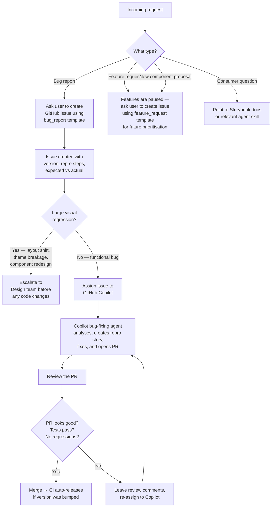
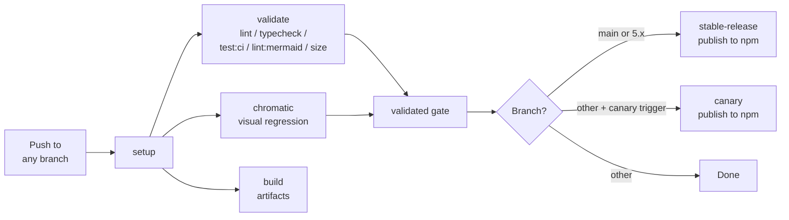
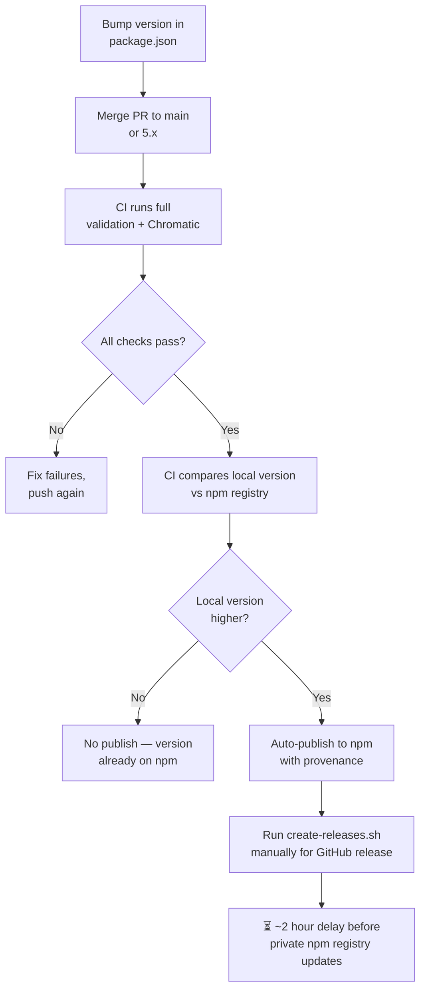
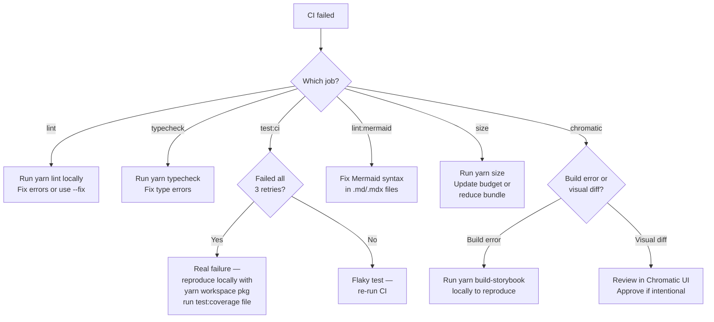
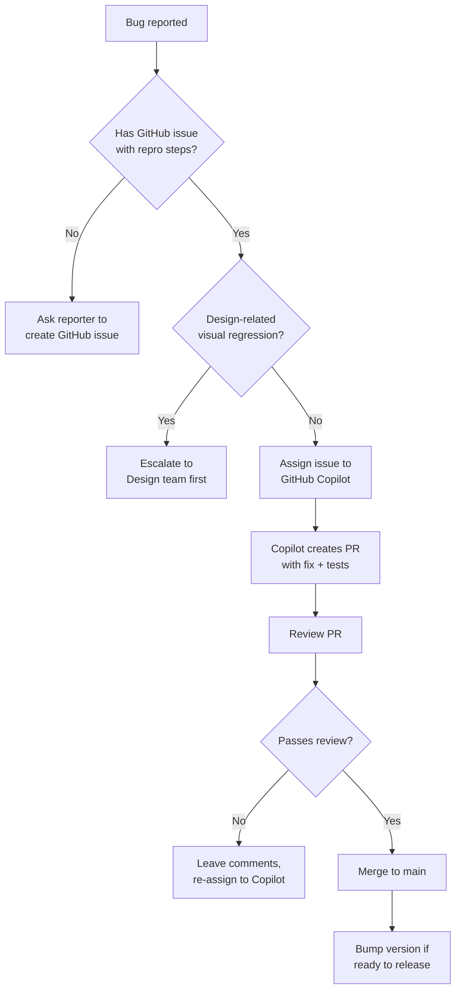

# Skill: IDS Repo Maintenance

## Purpose

Help maintainers perform day-to-day tasks in the IDS monorepo — fixing bugs, managing releases, reviewing PRs, fixing CI, and keeping documentation in sync.

## Triage & Prioritisation

During this period, the focus is **bug fixes only — no new features, no regressions**.



**Key rules:**
- Bug fixes are the priority — fix what's broken, prevent regressions
- Features are paused — ask requesters to file a `feature_request` or `new-component-proposal` issue so we can validate the approach when the team is at full capacity
- Large visual regressions (layout shifts, theme breakage, component redesigns) need Design team sign-off before merging
- For functional bugs: users create a GitHub issue using the `bug_report` template (`.github/ISSUE_TEMPLATE/bug_report.md`), then assign it to Copilot
- Copilot's bug-fixing agent will solve issues autonomously — see `docs/COPILOT-AGENT-SETUP.md` for setup and usage
- Cross-branch bugs use labels (`affects-main`, `affects-5.x`, `affects-both-branches`) — the Copilot agent handles this automatically, see `.github/CROSS_BRANCH_LABELS.md`

**Issue templates available:**

| Template | When to use | GitHub label |
|---|---|---|
| `bug_report` | Something is broken | `bug` |
| `feature_request` | Enhancement idea (paused — file for later) | `enhancement` |
| `new-component-proposal` | New component idea (paused — file for later) | — |

## When to Use

- Triaging and fixing bugs reported by consumers (primary focus)
- Reviewing PRs (including Copilot-generated ones) — ensure no regressions
- Fixing CI failures or flaky tests
- Cutting a release after bug fixes are merged
- Updating dependencies (security patches, minor bumps)
- Keeping documentation and agent skills in sync after changes

## Prerequisites

```bash
corepack enable
yarn
yarn prepare   # installs husky hooks, builds all packages
```

Node 22, Yarn 4 (Berry). The `packageManager` field in root `package.json` pins the exact Yarn version.

## Monorepo Structure

Build order: `tokens` → `theme-preset` → `components`. Always respect this when building.

`yarn build` runs all package builds in topological order, then runs `yarn translate` which generates:
- AI component docs (`packages/*/.ai/`) — from `apps/guidelines/content/` MDX + component meta + stories
- Token reference (`token-reference.md`) — from `@iress-oss/ids-tokens` schema
- Skills translations — from `.agents/skills/` to package `.ai/skills/`
- `llms.txt` discovery files for each package
- `IDS-FULL-REFERENCE.md` — concatenation of all docs

The translate pipeline (`scripts/translate.ts`) uses:
- **StoryEmbed resolution** — extracts code from stories (P1 args, P2 mocks, P3 inline renders)
- **Plugin system** — overrides for reference tables, decision trees, interactive stories
- **react-docgen-typescript** — extracts props tables from component source
- **ComponentMeta** — `subComponents` and `additionalProps` for documentation enrichment

| Package | Path | Purpose |
|---|---|---|
| `@iress-oss/ids-tokens` | `packages/tokens/` | Design tokens (colour, spacing, typography, radius) |
| `@iress-oss/ids-theme-preset` | `packages/theme-preset/` | Panda CSS theme preset |
| `@iress-oss/ids-components` | `packages/components/` | React component library |
| Storybook addons | `packages/storybook-*/` | Config, Okta, sandbox, toggle-stories, version-badge |

## Task Workflows

### 1. Adding a New Component

Each component lives in `packages/components/src/components/<Name>/` with these required files:

```
ComponentName/
├── index.ts                    # Exports
├── ComponentName.tsx           # Implementation (Iress prefix, IressStyledProps)
├── ComponentName.styles.ts     # Panda CSS CVA recipe
├── ComponentName.stories.tsx   # Storybook stories
├── ComponentName.test.tsx      # Vitest tests
└── ComponentName.docs.mdx      # Documentation
```

Checklist:
1. Follow the naming convention: `Iress<Name>` for the component, `Iress<Name>Props` for the interface
2. Extend `IressStyledProps` (or `IressUnstyledProps`, `IressTextProps`) as appropriate
3. Include `propagateTestid` support
4. Add comprehensive JSDoc on all props
5. Export from `packages/components/src/main.ts`
6. Add `.ai/components/<name>.md` AI context doc
7. Update agent skills if the component introduces a new pattern (see [PR Documentation Sync](#7-pr-documentation-sync))

Full guide: `.github/instructions/component-creation.instructions.md`

### 2. Modifying Design Tokens

Token schemas live in `packages/tokens/src/schema/` as TypeScript files.

```bash
# After modifying token schemas:
yarn workspace @iress-oss/ids-tokens run cssVars   # regenerate CSS variables
yarn workspace @iress-oss/ids-tokens run build      # full build
yarn build                                          # rebuild downstream (theme-preset → components)
```

Checklist:
- New token category? Add entry to `packages/tokens/.ai/index.json` with `name`, `description`, `schemaSource`, `cssVariablePrefix`
- CSS variables follow `--iress-{category}-{name}` naming
- Update `.agents/skills/token-usage/references/token-reference.md` if token values change
- Run `yarn test:coverage` in tokens package to verify transforms

### 3. Running Validation

```bash
# Full validation suite (what CI runs):
yarn lint                # ESLint across all packages
yarn typecheck           # TypeScript strict mode
yarn test:ci             # Vitest with coverage + coverage threshold check
yarn lint:mermaid        # Validate Mermaid diagrams in docs
yarn size                # Bundle size against budgets

# Local development (no threshold check):
yarn test:coverage       # Vitest with coverage (runs once, exits)

# Single package:
yarn workspace @iress-oss/ids-components run test:coverage
yarn workspace @iress-oss/ids-components run test:coverage Button.test.tsx

# Single file lint:
yarn workspace @iress-oss/ids-components exec npx eslint src/components/Button/Button.tsx --fix
```

Note: `test:ci` = `test:coverage` + `check-coverage --all` (enforces coverage thresholds). CI retries `test:ci` up to 3 times for flaky tests.

⚠️ Never run `yarn dev`, `yarn test` (without `:coverage`), or any `watch` command in automated workflows — they never exit.

Exception: `yarn dev` is acceptable when using Playwright CLI/MCP or Chrome DevTools with your agent to visually debug components. Be aware it starts a persistent process that never exits — you must manually stop it when done.

### 4. Bundle Size Management

Budgets are defined in `.size-limit.json`:

| Bundle | Limit |
|---|---|
| `@iress-oss/ids-components` JS | 377 kB gzip |
| `@iress-oss/ids-components` CSS | 46 kB gzip |
| `@iress-oss/ids-tokens` JS | 20 kB gzip |
| `@iress-oss/ids-tokens` CSS | 3 kB gzip |

```bash
yarn size          # check against budgets
yarn size:check    # JSON output for scripting
```

If a budget is exceeded:
1. Check if the increase is justified (new component, new token category)
2. If justified, update the limit in `.size-limit.json`
3. If not, investigate — tree-shaking issues, unnecessary dependencies, unoptimised styles
4. Consider code-splitting or lazy loading for large additions

### 5. Dependency Updates

```bash
# Check outdated:
yarn upgrade-interactive

# After updating:
yarn                     # reinstall
yarn build               # verify build
yarn lint && yarn typecheck && yarn test:ci   # full validation
yarn size                # check bundle impact
```

Key constraints:
- React peer dependency is `^17 || ^18 || ^19` (devDependencies use React 19)
- Panda CSS version must stay compatible with `@iress-oss/ids-theme-preset`
- Storybook addons must match the Storybook major version (currently 10.x)
- `@typescript-eslint/*` packages must be on the same minor version

### 6. CI/CD & Releases

CI runs on every push via `.github/workflows/ci-cd.yml`.

**Pipeline overview:**



**Pipeline stages:**
1. `setup` — install deps, build all packages (cached)
2. `validate` — parallel matrix: `lint`, `typecheck`, `test:ci`, `lint:mermaid`, `size`
3. `build` — upload build artifacts
4. `chromatic` — visual regression testing via Chromatic (root, components, tokens). Auto-accepts changes on `main` and `5.x`. On feature branches, visual diffs must be reviewed and approved in the Chromatic UI before the job passes
5. `validated` — gate job, requires validate + chromatic to pass
6. `stable-release` or `canary` — publish to npm

**Branches:**
- `main` — v6 development (current). Pushes here trigger stable releases
- `5.x` — v5 maintenance only. Also triggers stable releases. v6 is never merged to `5.x` — the two branches are completely independent

**How to cut a stable release:**



Steps:
1. Bump the `version` field in the package's `package.json` (e.g. `6.0.0-beta.1` → `6.0.0-beta.2`)
2. Merge to `main` (or `5.x` for v5 backports)
3. CI detects the local version is higher than what's on npm and publishes automatically
4. After publish, create a GitHub release: `.github/scripts/create-releases.sh` (currently run manually — the CI step is commented out pending permissions). It creates a tagged GitHub release with auto-generated notes and npm install instructions
5. ⏳ There is approximately a **2-hour delay** before published packages become available in the private npm registry. Consumers won't see the new version immediately

The `stableVersion` field in `package.json` tracks the last known stable version — it is informational and does not affect the publish process.

**Stable releases:**
- Triggered automatically on push to `main` or `5.x` branches
- Detects version changes via `.github/scripts/publish-packages.sh` (compares local version to npm registry)
- Publishes to npm with `latest` tag (or prerelease tag like `alpha`/`beta` based on the version string)
- Requires the `npm-publishing` environment approval
- Do NOT publish stable releases manually via `npm publish`

**Canary releases** (two triggers):
```bash
# Option 1: GitHub Actions workflow_dispatch
# Go to Actions → CI/CD → Run workflow → Check "Publish canary release"
# Optionally select a specific package

# Option 2: Commit message trigger (any non-main branch)
git commit -m "feat: my change [canary]"              # publishes all packages
git commit -m "feat: my change [canary:@iress-oss/ids-components]"  # single package
```

**Troubleshooting CI failures:**



| Failure | What to do |
|---|---|
| `lint` failed | Run `yarn lint` locally, fix errors. For a single file: `yarn workspace <pkg> exec npx eslint <path> --fix` |
| `typecheck` failed | Run `yarn typecheck` locally. Usually a missing type import or strict mode violation |
| `test:ci` failed after 3 retries | Likely a real test failure, not flaky. Run `yarn workspace <pkg> run test:coverage <file>` locally to reproduce |
| `lint:mermaid` failed | A Mermaid diagram in a `.md`/`.mdx` file has invalid syntax. Run `yarn lint:mermaid` locally |
| `size` failed | Bundle budget exceeded. Run `yarn size` to see which budget. See [Bundle Size Management](#4-bundle-size-management) |
| `chromatic` has visual changes | Review diffs in the Chromatic UI (link in the PR check). Approve if intentional, fix if not |
| `chromatic` failed (not visual) | Usually a Storybook build error. Run `yarn build-storybook` locally to reproduce |

### 7. PR Documentation Sync

When code changes, these docs must stay in sync. Flag missing updates as required changes in PR review.

| What changed | Update these |
|---|---|
| Token schema (`packages/tokens/src/schema/`) | `packages/tokens/.ai/index.json`, `.agents/skills/token-usage/` |
| Component API (new/renamed/removed props) | `.ai/components/<name>.md`, relevant agent skills |
| New component | `main.ts` export, `.ai/components/`, skills (`ui-translation`, `figma-to-ids`, `ui-doctor`) |
| Package scripts or setup steps | Root `AGENTS.md`, package-level `AGENTS.md` |
| Monorepo structure | Root `AGENTS.md`, `README.md` |
| Code style config | Root `AGENTS.md` (`.prettierrc.cjs`, `.editorconfig` sections) |

Full PR review guide: `.github/instructions/pr-review.instructions.md`

### 8. Bug Fixing



**Preferred workflow — let Copilot handle it:**
1. Ensure the issue is in GitHub with clear reproduction steps
2. Assign the issue to GitHub Copilot (see `docs/COPILOT-AGENT-SETUP.md`)
3. Copilot's bug-fixing agent will analyse, create a reproduction story, fix, and open a PR
4. Review the PR Copilot creates — check the fix is targeted and tests cover the regression
5. If the PR needs changes, leave review comments and re-assign to Copilot

**Manual workflow (if Copilot can't solve it):**
1. Parse the issue — extract symptoms, affected components, reproduction steps
2. Confirm understanding before investigating
3. Create a Storybook story reproducing the bug (in the root component's stories file)
4. Fix the issue with a targeted change
5. Add/update tests covering the fix
6. Run full validation before pushing

Full guide: `.github/instructions/bugfixing.instructions.md`

### 9. Running Storybook Locally

```bash
yarn dev          # starts all 3 Storybook instances + watchers
```

Ports:
- `6005` — root Storybook (monorepo-level docs)
- `6006` — components Storybook
- `6007` — tokens Storybook

If ports are stuck from a previous session:
```bash
yarn dev:kill     # kills processes on ports 6005, 6006, 6007
```

Use `yarn dev` when you need to visually debug with Playwright CLI/MCP or Chrome DevTools. Remember it never exits — stop it manually when done.

### 10. Deprecating a Component

1. Add `@deprecated` JSDoc tag to the component and its props interface with a migration note
2. Keep the component exported from `main.ts` (don't remove — that's a breaking change)
3. Update the component's `.docs.mdx` with a deprecation banner and migration guidance
4. Update `.agents/skills/ui-doctor/` so it flags usage of the deprecated component
5. Update `.agents/skills/version-migration/` if this will be removed in the next major

### 11. Git Hooks (Husky)

`yarn prepare` installs husky hooks. They run automatically:
- **pre-commit** — runs `lint-staged` (lints and formats staged files)
- **pre-push** — runs tests

If a commit or push is blocked, it's because lint or tests failed on your changed files. Fix the issues rather than bypassing hooks.

## Code Style Quick Reference

- TypeScript strict, single quotes, semicolons, trailing commas (`all`), 2-space indent
- LF line endings, UTF-8
- `import type { Foo }` — prefer inline type imports
- Unused vars with `_` prefix are allowed
- Markdown/MDX: 80 char line length
- File order: Imports → Types → Constants → Helpers → Main Exports
- Test file order: Imports → Mocks → Test Data → Helpers → Test Suites

## Common Pitfalls

| Pitfall | Fix |
|---|---|
| Running `yarn test` in CI/scripts | Use `yarn test:coverage` (exits after running) |
| Running `yarn dev` in CI/scripts | Use `yarn build` (one-shot). `yarn dev` is only acceptable for interactive debugging with Playwright/MCP or Chrome DevTools — it never exits |
| Editing `packages/components/src/styled-system/` | Never — it's auto-generated by Panda CSS |
| Editing `packages/tokens/src/generated/` | Never — regenerate with `yarn workspace @iress-oss/ids-tokens run cssVars` |
| Building components without building tokens first | Always build in order: tokens → theme-preset → components |
| Creating tests for pure type/interface files | Don't — no runtime behaviour to test |
| Forgetting to update `.ai/` docs after API changes | PR review should catch this — see [PR Documentation Sync](#7-pr-documentation-sync) |
| Bundle size budget exceeded after adding a component | Check `.size-limit.json`, update budget if justified |
| Merging v6 work into `5.x` branch | Never — `main` and `5.x` are completely independent branches. v6 is never merged to `5.x` |
| Running `npm publish` manually | Always use CI. Stable releases are triggered by version bump + push to `main`/`5.x` |
| Bumping major version without team consensus | Major versions require migration guides, skill updates, and coordinated rollout |
| Expecting immediate npm availability after publish | There is a ~2 hour delay before packages appear in the private npm registry |

## Related Skills

Use these sibling skills for specialised tasks:

| Skill | Use when |
|---|---|
| `token-usage` | Working with design tokens, CSS variables, spacing/colour/typography values |
| `ui-translation` | Converting a UI description into IDS component code |
| `figma-to-ids` | Translating Figma designs into IDS implementations |
| `ui-doctor` | Auditing UI for IDS compliance, accessibility, or usability issues |
| `version-migration` | Migrating consumers between IDS major versions (v4→v5, v5→v6) |

## Related Resources

- `.github/instructions/component-creation.instructions.md` — full component creation guide
- `.github/instructions/bugfixing.instructions.md` — bug fixing workflow
- `.github/instructions/pr-review.instructions.md` — PR review checklist
- `.github/instructions/file-organization.instructions.md` — file ordering conventions
- `.github/instructions/eslint.instructions.md` — linting commands
- `.github/instructions/testing-single-files.instructions.md` — running individual tests
- `AGENTS.md` (root) — monorepo-level agent context
- `packages/components/AGENTS.md` — components package context
- `packages/tokens/AGENTS.md` — tokens package context
