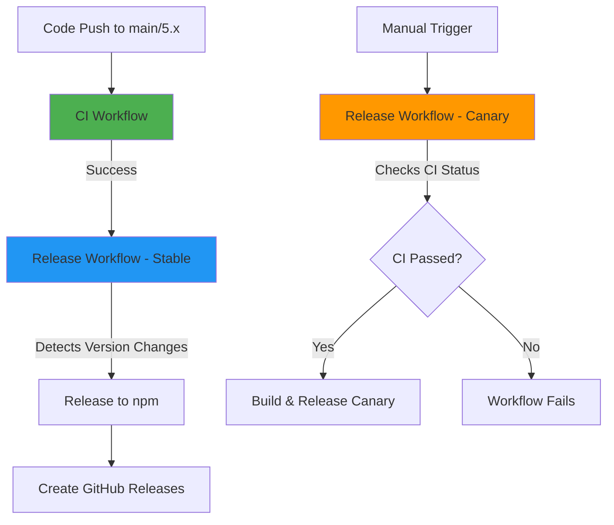
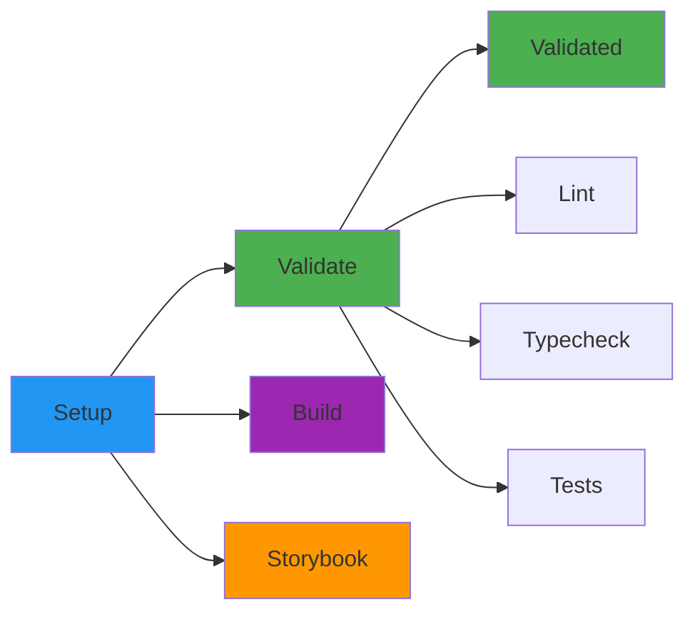
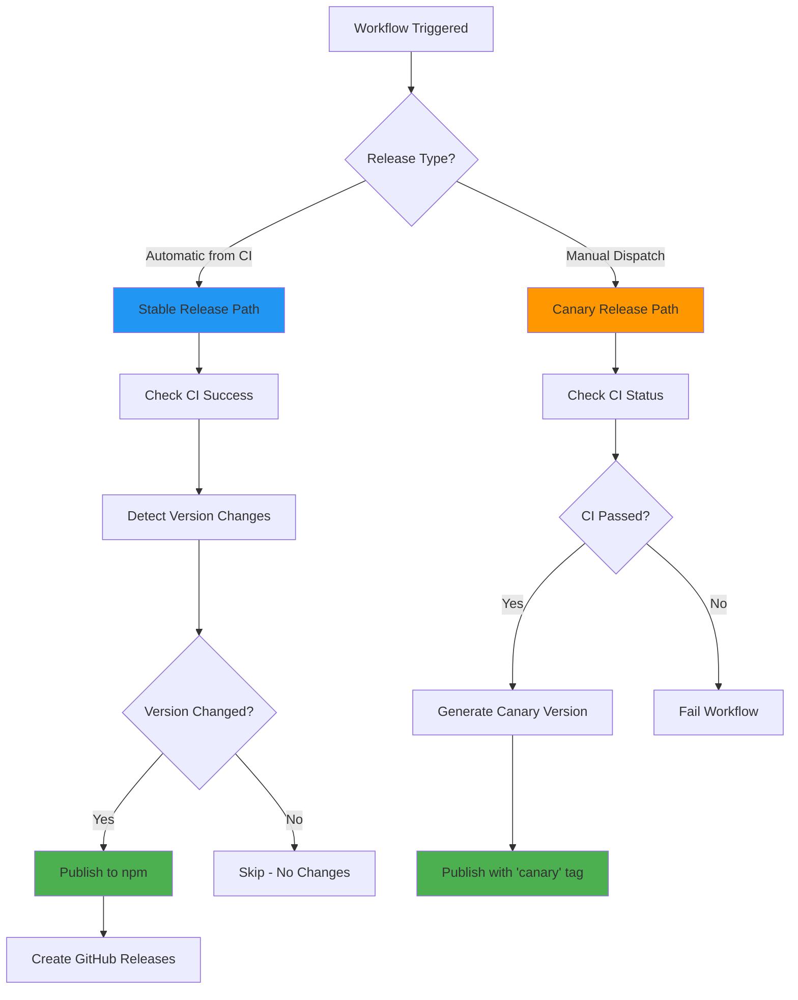
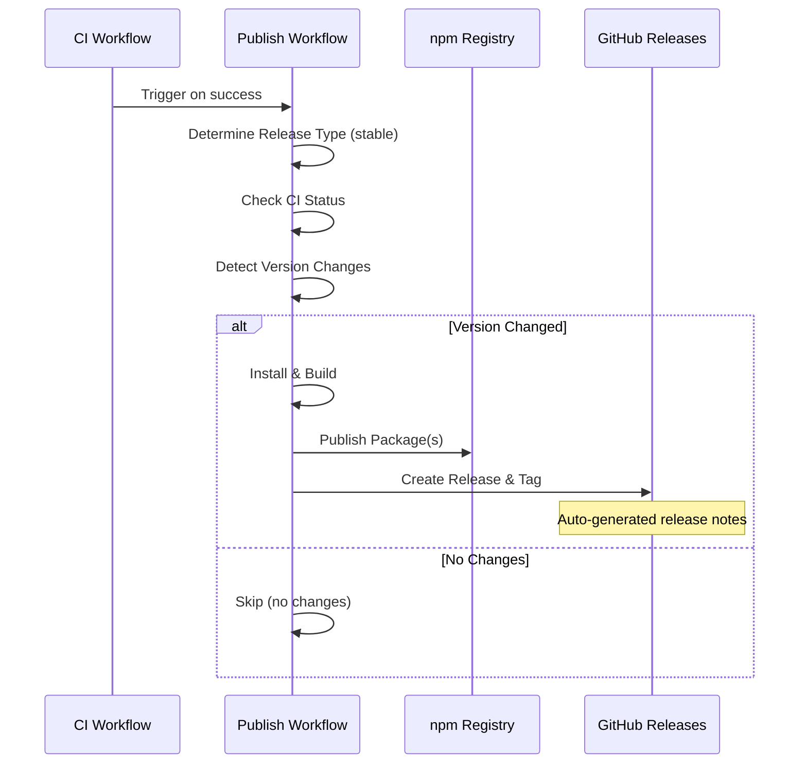
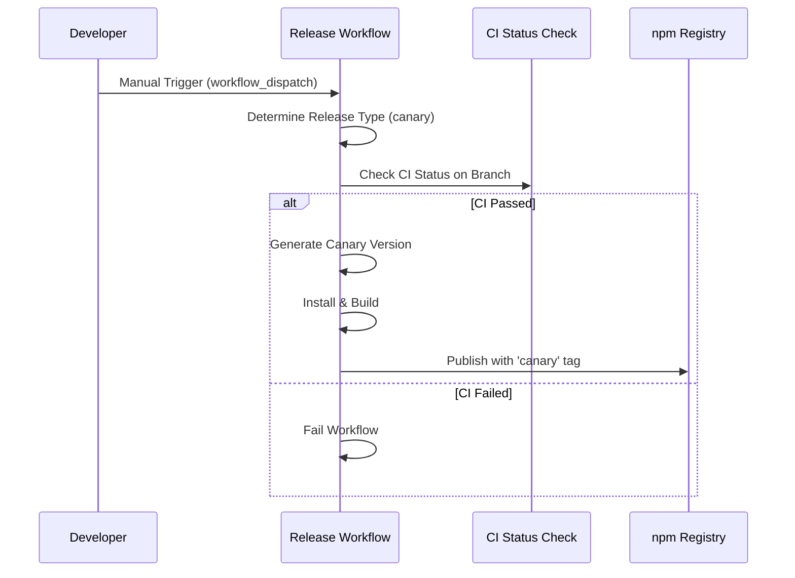

# GitHub Actions Workflows Documentation

This document describes the CI/CD workflows for the Iress Design System.

## Overview

The project uses two main GitHub Actions workflows:

1. **CI** - Continuous Integration for validation
2. **Release** - Automated releases and manual canary releases to npm

## Workflow Relationships



## 1. CI Workflow

**File:** `.github/workflows/ci.yml`

**Triggers:**

- Pull requests to `main` or `5.x` branches
- Direct pushes to `main` or `5.x` branches

**Purpose:** Validates code quality and ensures all tests pass before merging or releasing.

### CI Workflow Stages



### Jobs

#### 1. Setup Job

- **Purpose:** Prepares the environment and caches dependencies
- **Steps:**
  1. Checkout code
  2. Setup Node.js (v22)
  3. Enable Corepack (Yarn)
  4. Cache Yarn dependencies
  5. Cache build outputs
  6. Install dependencies
  7. Build all packages

#### 2. Validate Job (Matrix)

Runs three validation checks in parallel:

- **Lint:** ESLint checks for code quality
- **Typecheck:** TypeScript type checking
- **Test:** Unit and integration tests with retry logic (up to 3 attempts)

#### 3. Build Job

- Verifies all packages can be built successfully
- Uploads build artifacts for 7 days

#### 4. Storybook Job

- Builds Storybook documentation
- Uploads Storybook static files for 7 days

#### 5. Validated Job

- Final gate that confirms all validation jobs passed
- Acts as a status check for branch protection rules

## 2. Release Workflow

**File:** `.github/workflows/release.yml`

**Triggers:**

- **Automatic (Stable Releases):** Runs after CI workflow completes successfully on `main` or `5.x` branches
- **Manual (Canary Releases):** Triggered via workflow dispatch from any branch

**Purpose:** Releases new package versions to npm. Supports both stable releases (when version changes are detected) and canary releases (for pre-release testing).

### Release Workflow Overview



### Release Type Detection

The workflow automatically determines the release type based on how it was triggered:

- **Stable Release:** Triggered by the CI workflow via `workflow_run`
- **Canary Release:** Triggered manually via `workflow_dispatch`

### Stable Release Process



### Canary Release Process



### Jobs

#### Packages Job

The workflow has a single job that handles both stable and canary releases:

##### 1. Determine Release Type

- Checks the event that triggered the workflow
- Sets release type to `stable` (for CI-triggered runs) or `canary` (for manual triggers)

##### 2. Check CI Status

**For Stable Releases:**

- Verifies the triggering CI workflow succeeded
- Fails if CI workflow did not complete successfully

**For Canary Releases:**

- Uses GitHub CLI to check the latest CI run on the current branch
- Ensures CI has passed before allowing canary publication
- Prevents publishing broken canary versions

##### 3. Setup & Install

- Standard Node.js and Yarn setup
- Installs dependencies
- Builds all packages

##### 4. Version Packages (Canary Only)

- Generates timestamped canary version: `0.0.0-canary.{timestamp}-{git-sha}`
- Example: `0.0.0-canary-20231211175530-a1b2c3d`
- Includes short git SHA for traceability
- Updates `package.json` without creating git tags
- Can target a specific package or all packages based on workflow input

##### 5. Detect Version Changes (Stable Only)

- Compares local `package.json` versions with npm registry
- Uses semantic version comparison
- Identifies which packages need publishing
- Sets output variables for subsequent steps

##### 6. Publish to npm

**For Canary Releases:**

- Publishes with `canary` npm tag
- Can be installed with `npm install @iress-oss/ids-components@canary`
- Respects the package selection from workflow input

**For Stable Releases:**

- Only runs if version changes were detected
- Determines npm tag based on version:
  - Prerelease versions (e.g., `1.0.0-alpha.1`) → `alpha` tag
  - Stable versions (e.g., `1.0.0`) → `latest` tag
- Publishes with npm provenance for security

##### 7. Create GitHub Releases (Stable Only)

- Only runs if stable version changes were detected
- **Creates git tag** (e.g., `@iress-oss/ids-components@1.2.3`) automatically via `gh release create`
- Tag points to the commit SHA that triggered the workflow
- Generates AI-powered release notes from commits and PRs
- Links to npm package page
- Both the git tag and GitHub release are created in a single operation

### Manual Canary Release Parameters

The workflow accepts one input parameter when triggered manually:

- **package:** (optional) Select a specific package to release, or leave empty to release all packages

Available packages:

- `@iress-oss/ids-components`
- `@iress-oss/ids-mcp-server`
- `@iress-oss/ids-storybook-config`
- `@iress-oss/ids-storybook-okta`
- `@iress-oss/ids-storybook-sandbox`
- `@iress-oss/ids-storybook-toggle-stories`
- `@iress-oss/ids-storybook-version-badge`
- `@iress-oss/ids-tokens`

### Canary Version Format

Canary versions follow this format:

```
0.0.0-canary.{timestamp}-{git-sha}
```

Example: `0.0.0-canary.20231211175530-a1b2c3d`

### Version Detection Logic (Stable Releases)

The workflow compares versions using semantic versioning rules:

- Major.Minor.Patch comparison
- Prerelease identifiers (alpha < beta < rc < stable)
- Only publishes if local version > registry version

### When to Use Canary Releases

- Testing breaking changes before official release
- Validating fixes in production-like environments
- Sharing work-in-progress features with stakeholders
- QA testing without affecting stable releases

## Best Practices

### For Developers

1. **Always wait for CI to pass** before merging or releasing
2. **Update versions in package.json** when making changes that should be released
3. **Use semantic versioning** (major.minor.patch) correctly:
   - **Major:** Breaking changes
   - **Minor:** New features (backward compatible)
   - **Patch:** Bug fixes
4. **Use canary releases** for testing before official releases
5. **Trigger canary releases manually** via GitHub Actions UI when needed

### For Release Management

1. **Check the Publish workflow** after merging to main/5.x
2. **Review auto-generated release notes** in GitHub Releases
3. **Monitor npm publish status** for any failures
4. **Version bumps should be committed** to trigger releases
5. **Use canary releases** for pre-release testing and validation

## Troubleshooting

### CI Workflow Fails

- Check the specific job that failed (lint, typecheck, or test)
- Review the error logs in GitHub Actions
- Run the same command locally: `yarn lint`, `yarn typecheck`, or `yarn test`

### Publish Workflow Doesn't Trigger (Stable Release)

- Ensure CI workflow completed successfully
- Verify you're on the `main` or `5.x` branch
- Check that version changes exist in `package.json`

### Canary Release Fails

- Verify CI has passed on your branch
- Check npm authentication credentials in GitHub environment
- Ensure package versions follow the canary format
- Confirm you have the correct permissions to trigger workflow_dispatch

### Version Not Detected by Publish Workflow

- Ensure the version in `package.json` is higher than the npm registry version
- Check that the package is not marked as `private: true`
- Verify semantic version comparison logic

## Environment Variables

All workflows use these environment variables:

- `NODE_VERSION: '22'` - Node.js version
- `YARN_VERSION: '4.10.3'` - Yarn version

## Required Secrets & Permissions

### Repository Settings

- **NPM_TOKEN:** npm authentication token (stored in GitHub environment `npm-publishing`)
- **GITHUB_TOKEN:** Automatically provided by GitHub Actions

### Workflow Permissions

- **CI Workflow:**
  - `contents: read` - Read repository contents
  - `actions: read` - Read workflow status

- **Publish Workflow:**
  - `id-token: write` - OIDC token for npm provenance
  - `contents: write` - Create tags and releases
  - `actions: read` - Check CI workflow status

## Custom Run Names

The workflow uses custom `run-name` fields to make workflow runs easier to identify in the GitHub Actions UI:

- **Canary:** Shows selected package and triggering user
  - Example: "@iress-oss/ids-components (canary) by @username"
  - Example: "all packages (canary) by @username"
- **Stable:** Shows the commit message that triggered the release
  - Example: "feat: add new button component"

## Workflow Trigger URL

To manually trigger a canary release, visit:

- https://github.com/iress/design-system/actions/workflows/release.yml

Click "Run workflow", select your branch, optionally choose a specific package, and click "Run workflow" again.

## Additional Resources

- [GitHub Actions Documentation](https://docs.github.com/en/actions)
- [Semantic Versioning](https://semver.org/)
- [npm Publishing Documentation](https://docs.npmjs.com/cli/v10/commands/npm-publish)
- [Yarn Workspaces](https://yarnpkg.com/features/workspaces)
- [npm Provenance](https://docs.npmjs.com/generating-provenance-statements)
