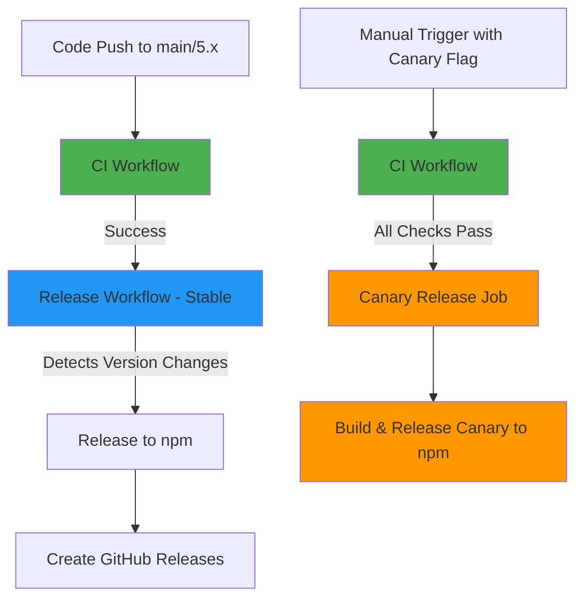
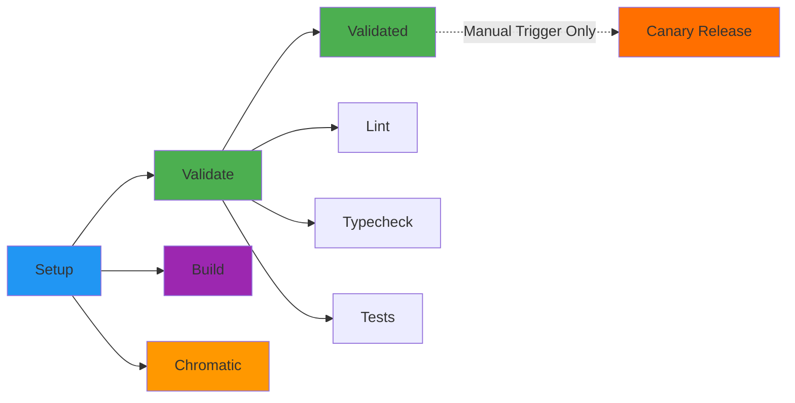
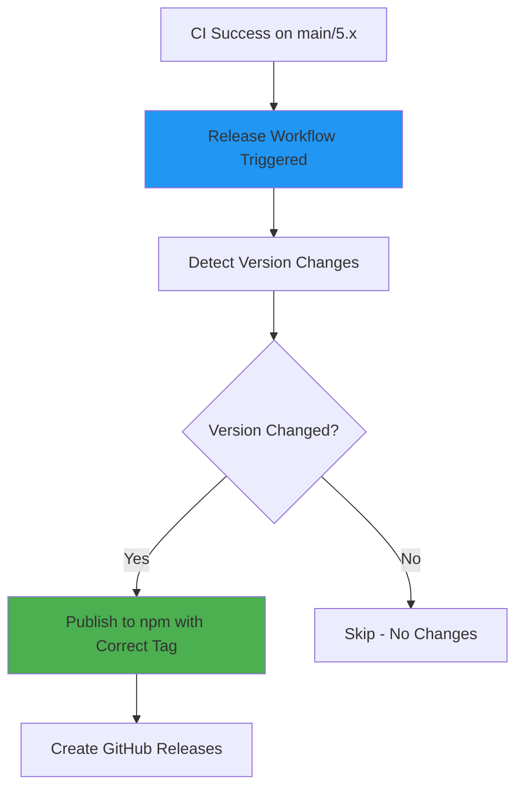
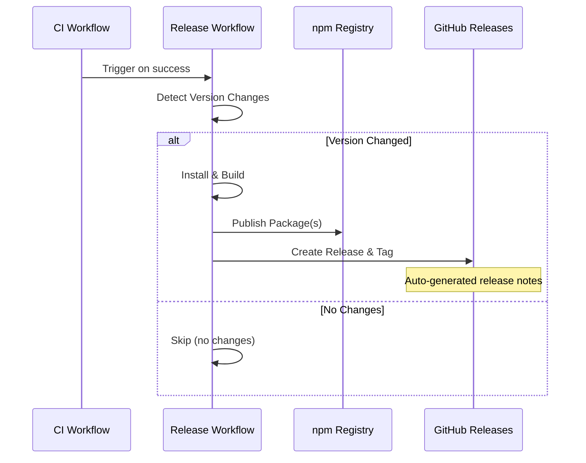
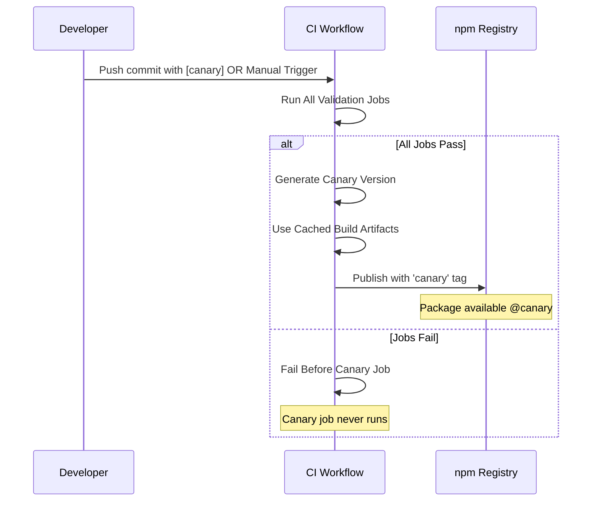

# GitHub Actions Workflows Documentation

This document describes the CI/CD workflows for the Iress Design System.

## Overview

The project uses two main GitHub Actions workflows:

1. **CI** - Continuous Integration for validation and canary releases
2. **Release** - Automated stable releases to npm

## Workflow Relationships



## 1. CI Workflow

**File:** `.github/workflows/ci.yml`

**Triggers:**

- Pull requests to `main` or `5.x` branches
- Direct pushes to `main` or `5.x` branches
- Manual trigger via workflow dispatch (for canary releases)
- Automatic canary release when commit message contains `[canary]` or `[canary:package-name]`

**Purpose:** Validates code quality, ensures all tests pass, and optionally publishes canary releases when manually triggered or when `[canary]` is in the commit message.

### CI Workflow Stages



### Jobs

#### 1. Setup Job

- **Purpose:** Prepares the environment and caches dependencies
- **Steps:**
  1. Checkout code
  2. Setup Node.js (v22)
  3. Enable Corepack (Yarn)
  4. Cache Yarn dependencies
  5. Cache build outputs
  6. Install dependencies
  7. Build all packages

#### 2. Validate Job (Matrix)

Runs three validation checks in parallel:

- **Lint:** ESLint checks for code quality
- **Typecheck:** TypeScript type checking
- **Test:** Unit and integration tests with retry logic (up to 3 attempts)

#### 3. Build Job

- Verifies all packages can be built successfully
- Uploads build artifacts for 7 days

#### 4. Chromatic Job

- Publishes Storybook to Chromatic for visual regression testing
- Runs for root, components, and tokens packages
- Auto-accepts changes on main/5.x branches

#### 5. Validated Job

- Final gate that confirms all validation jobs passed
- Acts as a status check for branch protection rules

#### 6. Canary Release Job (Manual Trigger or `[canary]` in Commit)

**Conditions:**

- Runs when `publish_canary` input is set to `true` (manual trigger)
- **OR** when commit message contains `[canary]` or `[canary:package-name]` on push to any branch
- Only runs on manual workflow dispatch or push events
- Requires all validation and build jobs to pass first
- Only runs for repositories owned by `iress`

**Steps:**

1. Restores cached dependencies and build outputs from setup job
2. Extracts package name from commit message if using `[canary:package-name]` syntax
3. Generates timestamped canary version: `0.0.0-canary-{timestamp}-{git-sha}`
4. Updates package.json version(s) for specified package or all packages
5. Configures npm authentication
6. Publishes to npm with `canary` tag
7. Can target specific package (manual trigger or commit syntax) or all packages

**Benefits:**

- Guarantees CI has passed before publishing canary
- No separate CI status check needed (runs as part of CI)
- Reuses cached build artifacts for faster execution
- Eliminates IP allowlist issues with GitHub API calls
- Convenient commit message trigger for automated canary releases
- Package-specific canary releases via commit message syntax

## 2. Release Workflow

**File:** `.github/workflows/release.yml`

**Triggers:**

- **Automatic (Stable Releases):** Runs after CI workflow completes successfully on `main` or `5.x` branches

**Purpose:** Releases new stable package versions to npm when version changes are detected in package.json files.

### Release Workflow Overview



### Release Type Detection

The workflow automatically publishes stable releases when:

- CI workflow completes successfully on `main` or `5.x`
- Version changes are detected in package.json files

**Note:** Canary releases are now handled by the CI workflow (see CI Workflow section above).

### Stable Release Process



### Canary Release Process

**Note:** Canary releases are now part of the CI workflow, not the Release workflow.



**Key Advantages:**

- Canary only publishes if all CI checks pass
- No separate CI status verification needed
- Reuses cached dependencies and builds
- Faster execution time
- No IP allowlist issues
- Automatic trigger via commit message `[canary]`

### Jobs

#### Packages Job

The Release workflow has a single job that handles stable releases:

##### 1. Setup & Install

- Standard Node.js and Yarn setup
- Installs dependencies
- Builds all packages

##### 2. Detect Version Changes

- Compares local `package.json` versions with npm registry
- Uses semantic version comparison
- Identifies which packages need publishing
- Sets output variables for subsequent steps

##### 3. Publish to npm

- Only runs if version changes were detected
- Determines npm tag based on version:
  - Prerelease versions (e.g., `1.0.0-alpha.1`) → `alpha` tag
  - Stable versions (e.g., `1.0.0`) → `latest` tag
- Publishes with npm provenance for security

##### 4. Create GitHub Releases

- Only runs if version changes were detected
- **Creates git tag** (e.g., `@iress-oss/ids-components@1.2.3`) automatically via `gh release create`
- Tag points to the commit SHA that triggered the workflow
- Generates AI-powered release notes from commits and PRs
- Links to npm package page
- Both the git tag and GitHub release are created in a single operation

### Manual Canary Release Parameters

To trigger a canary release, you have two options:

#### Option 1: Commit Message Trigger (Automatic)

Simply include `[canary]` or `[canary:package-name]` anywhere in your commit message:

**Publish all packages:**

```bash
git commit -m "feat: add new feature [canary]"
git push
```

**Publish specific package:**

```bash
git commit -m "fix: update tokens [canary:@iress-oss/ids-tokens]"
git push
```

When pushed to any branch, the CI workflow will automatically publish a canary release after all checks pass.

#### Option 2: Manual Workflow Trigger

Use the CI workflow with these input parameters:

- **publish_canary:** (required) Set to `true` to publish a canary release after CI passes
- **package:** (optional) Select a specific package to release, or leave empty to release all packages

Available packages:

- `@iress-oss/ids-components`
- `@iress-oss/ids-mcp-server`
- `@iress-oss/ids-storybook-config`
- `@iress-oss/ids-storybook-okta`
- `@iress-oss/ids-storybook-sandbox`
- `@iress-oss/ids-storybook-toggle-stories`
- `@iress-oss/ids-storybook-version-badge`
- `@iress-oss/ids-tokens`

**How to Trigger Manually:**

1. Go to Actions → CI workflow
2. Click "Run workflow"
3. Select your branch
4. Check "Publish canary release after CI passes"
5. Optionally select a specific package
6. Click "Run workflow"

**Comparison:**

| Method                            | Packages Published | Package Selection       | Use Case                          |
| --------------------------------- | ------------------ | ----------------------- | --------------------------------- |
| `[canary]` in commit              | All packages       | No (all packages only)  | Quick canary for all packages     |
| `[canary:package-name]` in commit | Single package     | Yes (specify in commit) | Quick canary for specific package |
| Manual trigger                    | Selected or all    | Yes (dropdown)          | Interactive package selection     |

### Canary Version Format

Canary versions follow this format:

```
0.0.0-canary-{timestamp}-{git-sha}
```

Example: `0.0.0-canary-20231211175530-a1b2c3d`

Components:

- **0.0.0**: Base version (always zero for canaries)
- **timestamp**: YYYYMMDDHHmmss format for chronological ordering
- **git-sha**: First 7 characters of the commit SHA for traceability

### Version Detection Logic (Stable Releases)

The Release workflow compares versions using semantic versioning rules:

- Major.Minor.Patch comparison
- Prerelease identifiers (alpha < beta < rc < stable)
- Only publishes if local version > registry version

### When to Use Canary Releases

Canary releases are perfect for:

- **Testing breaking changes** before official release
- **Validating fixes** in production-like environments
- **Sharing work-in-progress features** with stakeholders
- **QA testing** without affecting stable releases
- **Branch testing** on any branch without merging to main
- **Quick testing** - just add `[canary]` or `[canary:package-name]` to your commit message

**Installation:**

```bash
npm install @iress-oss/ids-components@canary
# or
yarn add @iress-oss/ids-components@canary
```

**Pro Tips:**

- Use `[canary]` for quick testing of all packages
- Use `[canary:@iress-oss/ids-tokens]` to test only the tokens package
- Manual trigger gives you UI-based package selection

## Best Practices

### For Developers

1. **Always wait for CI to pass** before merging or releasing
2. **Update versions in package.json** when making changes that should be released
3. **Use semantic versioning** (major.minor.patch) correctly:
   - **Major:** Breaking changes
   - **Minor:** New features (backward compatible)
   - **Patch:** Bug fixes
4. **Use canary releases** for testing before official releases:
   - Quick all packages: Add `[canary]` to your commit message
   - Quick single package: Add `[canary:@iress-oss/ids-tokens]` to your commit message
   - Selective with UI: Trigger CI workflow manually with specific package
5. **Test canary releases** in your projects before bumping stable versions

### For Release Management

1. **Check the Release workflow** after merging to main/5.x
2. **Review auto-generated release notes** in GitHub Releases
3. **Monitor npm publish status** for any failures
4. **Version bumps should be committed** to trigger releases
5. **Test with canary releases** before bumping stable versions

## Troubleshooting

### CI Workflow Fails

- Check the specific job that failed (lint, typecheck, or test)
- Review the error logs in GitHub Actions
- Run the same command locally: `yarn lint`, `yarn typecheck`, or `yarn test`

### Release Workflow Doesn't Trigger (Stable Release)

- Ensure CI workflow completed successfully
- Verify you're on the `main` or `5.x` branch
- Check that version changes exist in `package.json`

### Canary Release Doesn't Run

- Ensure you either:
  - Included `[canary]` or `[canary:package-name]` in your commit message, OR
  - Checked the "Publish canary release after CI passes" checkbox (manual trigger)
- Verify the workflow was triggered (check Actions tab)
- Check that all CI jobs (lint, typecheck, test) passed
- Confirm you have write permissions to the repository
- For package-specific canary, ensure the package name is valid and matches exactly

### Canary Release Fails After CI Passes

- Check npm authentication credentials in GitHub environment `npm-publishing`
- Verify the branch has proper permissions
- Review the canary job logs for specific errors

### Version Not Detected by Release Workflow

- Ensure the version in `package.json` is higher than the npm registry version
- Check that the package is not marked as `private: true`
- Verify semantic version comparison logic

## Environment Variables

All workflows use these environment variables:

- `NODE_VERSION: '22'` - Node.js version
- `YARN_VERSION: '4.10.3'` - Yarn version

## Required Secrets & Permissions

### Repository Settings

- **NPM_TOKEN:** npm authentication token (stored in GitHub environment `npm-publishing`)
- **GITHUB_TOKEN:** Automatically provided by GitHub Actions

### Workflow Permissions

- **CI Workflow:**
  - `contents: read` - Read repository contents
  - `contents: write` - Create tags and releases (canary job only)
  - `id-token: write` - OIDC token for npm provenance (canary job only)

- **Release Workflow:**
  - `id-token: write` - OIDC token for npm provenance
  - `contents: write` - Create tags and releases
  - `actions: read` - Read workflow status

## Custom Run Names

The workflows use custom `run-name` fields to make workflow runs easier to identify in the GitHub Actions UI:

- **CI Workflow:**
  - Default: Shows the commit message or PR title
  - Canary: Shows selected package and triggering user
    - Example: "@iress-oss/ids-components (canary) by @username"
    - Example: "all packages (canary) by @username"

- **Release Workflow:**
  - Shows the commit message that triggered the release
    - Example: "feat: add new button component"

## Workflow Trigger URLs

### CI Workflow (for canary releases)

To manually trigger a canary release, visit:

- https://github.com/iress/design-system/actions/workflows/ci.yml

**Steps:**

1. Click "Run workflow"
2. Select your branch
3. Check "Publish canary release after CI passes"
4. Optionally select a specific package
5. Click "Run workflow"

The workflow will run all CI checks first, and only publish the canary if everything passes.

### Release Workflow (automatic only)

The Release workflow is triggered automatically after CI success on main/5.x:

- https://github.com/iress/design-system/actions/workflows/release.yml

No manual triggering needed for stable releases.

## Additional Resources

- [GitHub Actions Documentation](https://docs.github.com/en/actions)
- [Semantic Versioning](https://semver.org/)
- [npm Publishing Documentation](https://docs.npmjs.com/cli/v10/commands/npm-publish)
- [Yarn Workspaces](https://yarnpkg.com/features/workspaces)
- [npm Provenance](https://docs.npmjs.com/generating-provenance-statements)
