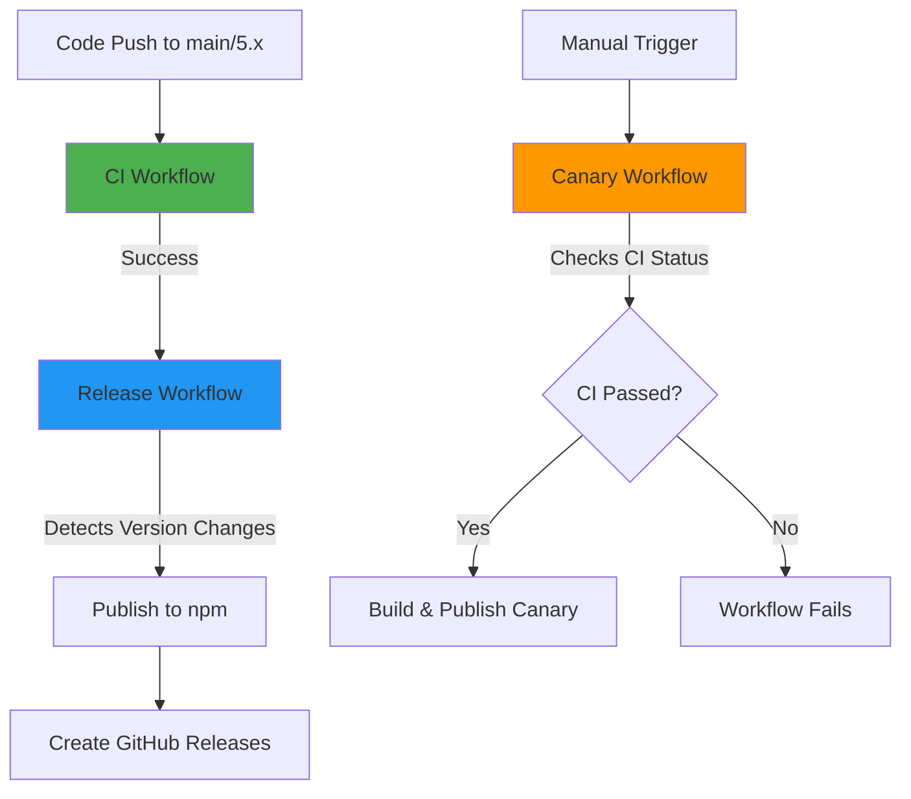
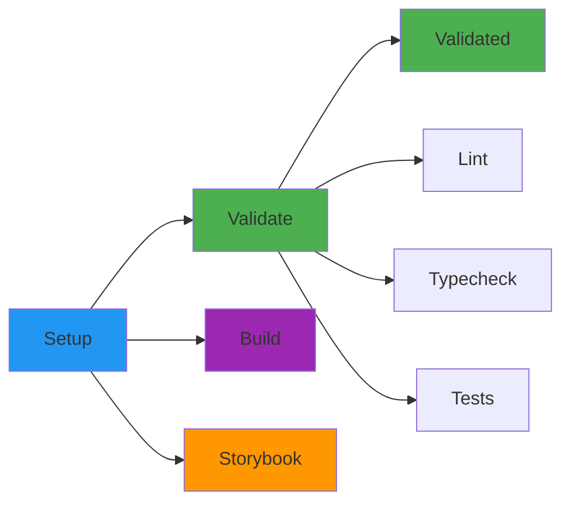
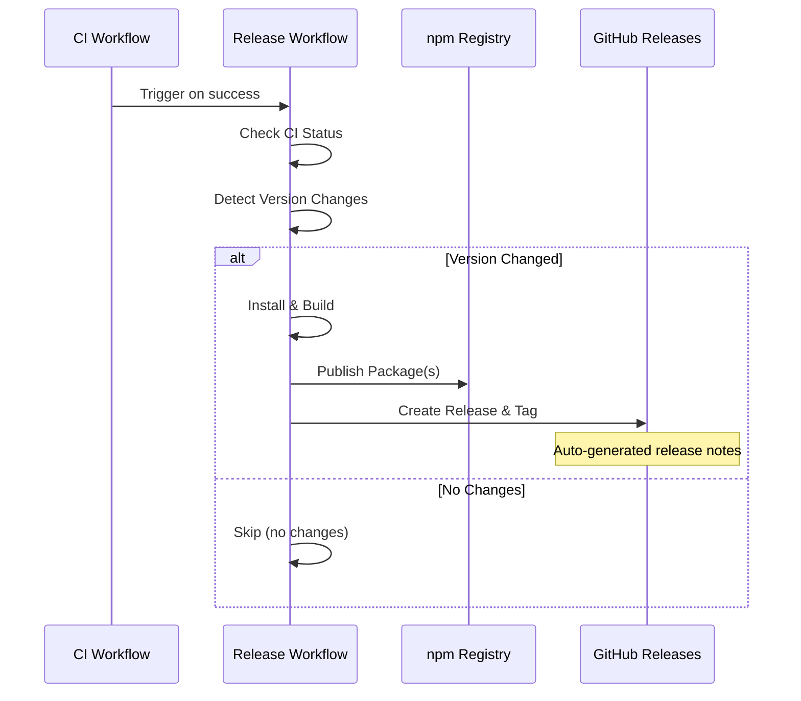
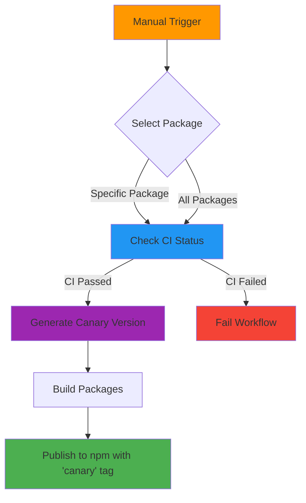

# GitHub Actions Workflows Documentation

This document describes the CI/CD workflows for the Iress Design System.

## Overview

The project uses three main GitHub Actions workflows:

1. **CI** - Continuous Integration for validation
2. **Release** - Automated releases to npm
3. **Canary** - Manual pre-release testing

## Workflow Relationships



## 1. CI Workflow

**File:** `.github/workflows/ci.yml`

**Triggers:**

- Pull requests to `main` or `5.x` branches
- Direct pushes to `main` or `5.x` branches

**Purpose:** Validates code quality and ensures all tests pass before merging or releasing.

### CI Workflow Stages



### Jobs

#### 1. Setup Job

- **Purpose:** Prepares the environment and caches dependencies
- **Steps:**
  1. Checkout code
  2. Setup Node.js (v22)
  3. Enable Corepack (Yarn)
  4. Cache Yarn dependencies
  5. Cache build outputs
  6. Install dependencies
  7. Build all packages

#### 2. Validate Job (Matrix)

Runs three validation checks in parallel:

- **Lint:** ESLint checks for code quality
- **Typecheck:** TypeScript type checking
- **Test:** Unit and integration tests with retry logic (up to 3 attempts)

#### 3. Build Job

- Verifies all packages can be built successfully
- Uploads build artifacts for 7 days

#### 4. Storybook Job

- Builds Storybook documentation
- Uploads Storybook static files for 7 days

#### 5. Validated Job

- Final gate that confirms all validation jobs passed
- Acts as a status check for branch protection rules

## 2. Release Workflow

**File:** `.github/workflows/release.yml`

**Triggers:**

- Automatically runs after CI workflow completes successfully on `main` or `5.x` branches

**Purpose:** Publishes new package versions to npm when version changes are detected.

### Release Workflow Process



### Jobs

#### Packages Job

1. **Check CI Success:** Verifies the triggering CI workflow succeeded
2. **Detect Version Changes:**
   - Compares local `package.json` versions with npm registry
   - Uses semantic version comparison
   - Identifies which packages need publishing
3. **Install & Build:** Only if version changes detected
4. **Publish to npm:**
   - Determines npm tag based on version:
     - Prerelease versions (e.g., `1.0.0-alpha.1`) → `alpha` tag
     - Stable versions (e.g., `1.0.0`) → `latest` tag
   - Publishes with npm provenance for security
5. **Create GitHub Releases:**
   - **Creates git tag** (e.g., `@iress-oss/ids-components@1.2.3`) automatically via `gh release create`
   - Tag points to the commit SHA that triggered the workflow
   - Generates AI-powered release notes from commits and PRs
   - Links to npm package page
   - Both the git tag and GitHub release are created in a single operation

### Version Detection Logic

The workflow compares versions using semantic versioning rules:

- Major.Minor.Patch comparison
- Prerelease identifiers (alpha < beta < rc < stable)
- Only publishes if local version > registry version

## 3. Canary Workflow

**File:** `.github/workflows/canary.yml`

**Triggers:**

- Manual dispatch via GitHub Actions UI: https://github.com/iress/design-system/actions/workflows/canary.yml

**Purpose:** Creates pre-release canary versions for testing without affecting stable releases.

### Canary Workflow Process



### Parameters

The workflow accepts one input parameter:

- **package:** (optional) Select a specific package to release, or leave empty to release all packages

Available packages:

- `@iress-oss/ids-components`
- `@iress-oss/ids-mcp-server`
- `@iress-oss/ids-storybook-config`
- `@iress-oss/ids-storybook-okta`
- `@iress-oss/ids-storybook-sandbox`
- `@iress-oss/ids-storybook-toggle-stories`
- `@iress-oss/ids-storybook-version-badge`
- `@iress-oss/ids-tokens`

### Canary Version Format

Canary versions follow this format:

```
0.0.0-canary-{timestamp}-{git-sha}
```

Example: `0.0.0-canary-20231211175530-a1b2c3d`

### Jobs

#### Packages Job

1. **Check CI Status:**
   - Uses GitHub CLI to check latest CI run on current branch
   - Fails if CI hasn't passed
   - Prevents publishing broken canary versions
2. **Setup & Install:** Standard Node.js and Yarn setup
3. **Build Packages:** Builds all packages
4. **Version Packages:**
   - Generates timestamped canary version
   - Includes short git SHA for traceability
   - Updates `package.json` without creating git tags
5. **Publish to npm:**
   - Publishes with `canary` npm tag
   - Can be installed with `npm install @iress-oss/ids-components@canary`

### When to Use Canary Releases

- Testing breaking changes before official release
- Validating fixes in production-like environments
- Sharing work-in-progress features with stakeholders
- QA testing without affecting stable releases

## Best Practices

### For Developers

1. **Always wait for CI to pass** before merging or releasing
2. **Update versions in package.json** when making changes that should be released
3. **Use semantic versioning** (major.minor.patch) correctly:
   - **Major:** Breaking changes
   - **Minor:** New features (backward compatible)
   - **Patch:** Bug fixes
4. **Use canary releases** for testing before official releases

### For Release Management

1. **Check the Release workflow** after merging to main/5.x
2. **Review auto-generated release notes** in GitHub Releases
3. **Monitor npm publish status** for any failures
4. **Version bumps should be committed** to trigger releases

## Troubleshooting

### CI Workflow Fails

- Check the specific job that failed (lint, typecheck, or test)
- Review the error logs in GitHub Actions
- Run the same command locally: `yarn lint`, `yarn typecheck`, or `yarn test`

### Release Workflow Doesn't Trigger

- Ensure CI workflow completed successfully
- Verify you're on the `main` or `5.x` branch
- Check that version changes exist in `package.json`

### Canary Release Fails

- Verify CI has passed on your branch
- Check npm authentication credentials in GitHub environment
- Ensure package versions follow the canary format

### Version Not Detected by Release Workflow

- Ensure the version in `package.json` is higher than the npm registry version
- Check that the package is not marked as `private: true`
- Verify semantic version comparison logic

## Environment Variables

All workflows use these environment variables:

- `NODE_VERSION: '22'` - Node.js version
- `YARN_VERSION: '4.10.3'` - Yarn version

## Required Secrets & Permissions

### Repository Settings

- **NPM_TOKEN:** npm authentication token (stored in GitHub environment `npm-publishing`)
- **GITHUB_TOKEN:** Automatically provided by GitHub Actions

### Workflow Permissions

- **CI Workflow:**
  - `contents: read` - Read repository contents
  - `actions: read` - Read workflow status

- **Release Workflow:**
  - `id-token: write` - OIDC token for npm provenance
  - `contents: write` - Create tags and releases

- **Canary Workflow:**
  - `id-token: write` - OIDC token for npm provenance
  - `contents: read` - Read repository contents
  - `actions: read` - Check CI workflow status

## Custom Run Names

The workflows use custom `run-name` fields to make workflow runs easier to identify in the GitHub Actions UI:

- **Canary:** Shows selected package and triggering user
  - Example: "Canary release for @iress-oss/ids-components by @username"
- **Release:** Shows the commit message that triggered the release
  - Example: "feat: add new button component"

## Additional Resources

- [GitHub Actions Documentation](https://docs.github.com/en/actions)
- [Semantic Versioning](https://semver.org/)
- [npm Publishing Documentation](https://docs.npmjs.com/cli/v10/commands/npm-publish)
- [Yarn Workspaces](https://yarnpkg.com/features/workspaces)
