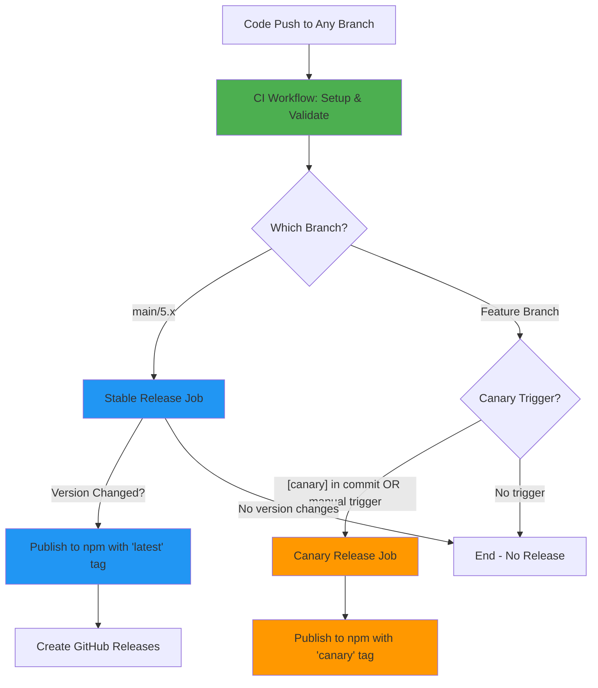
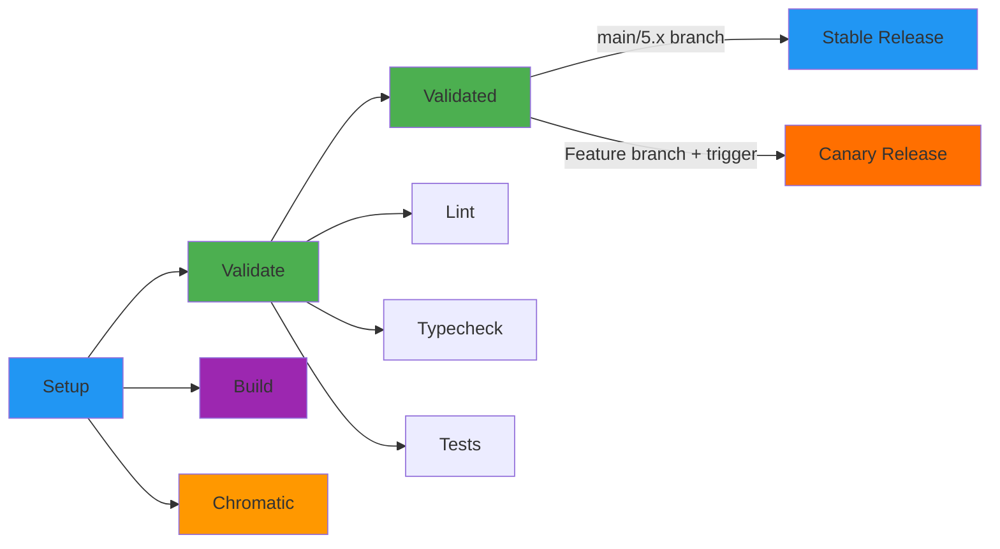
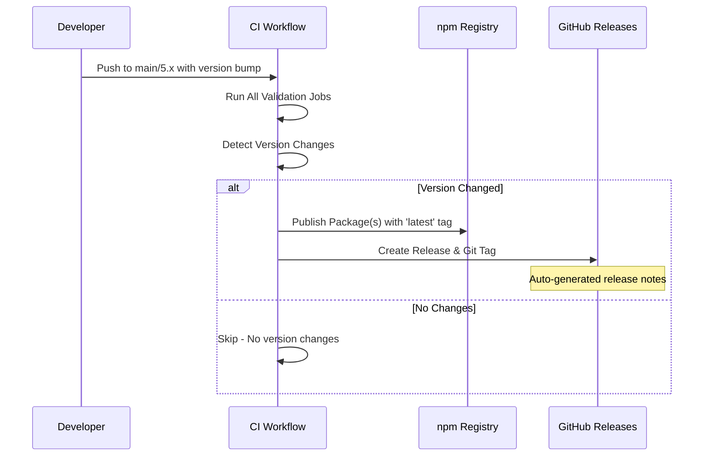
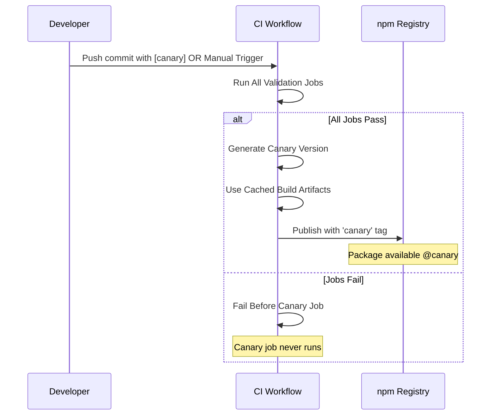

# GitHub Actions Workflows Documentation

This document describes the CI/CD workflow for the Iress Design System.

## Overview

The project uses a **single unified CI workflow** that handles:

1. **Continuous Integration** - Code validation (lint, typecheck, tests)
2. **Stable Releases** - Automated releases to npm on main/5.x branches
3. **Canary Releases** - Pre-release builds for testing on feature branches

## Workflow Architecture



## CI Workflow (Unified CI/CD)

**File:** `.github/workflows/ci-cd.yml`

**Triggers:**

- **Push to any branch** - Runs validation on all branches
- **Pull requests** - Validates changes before merging
- **Merge groups** - Validates merge queue for main/5.x branches
- **Manual dispatch** - For triggering canary releases with UI

**Purpose:**

- Validates code quality and ensures all tests pass on every push
- Automatically publishes **stable releases** when code is pushed to main/5.x branches
- Optionally publishes **canary releases** for testing on feature branches

### Complete Workflow Flow



### Jobs

#### 1. Setup Job

- **Purpose:** Prepares the environment and caches dependencies
- **Steps:**
  1. Checkout code
  2. Setup Node.js (v22)
  3. Enable Corepack (Yarn)
  4. Cache Yarn dependencies
  5. Cache build outputs
  6. Install dependencies
  7. Build all packages

#### 2. Validate Job (Matrix)

Runs three validation checks in parallel:

- **Lint:** ESLint checks for code quality
- **Lint:mermaid:** Mermaid diagram syntax validation (requires Chromium)
- **Typecheck:** TypeScript type checking
- **Test:** Unit and integration tests with retry logic (up to 3 attempts)

#### 3. Build Job

- Verifies all packages can be built successfully
- Uploads build artifacts for 7 days

#### 4. Chromatic Job

- Publishes Storybook to Chromatic for visual regression testing
- Runs for root, components, and tokens packages
- Auto-accepts changes on main/5.x branches

#### 5. Validated Job

- Final gate that confirms all validation jobs passed
- Acts as a status check for branch protection rules
- Required dependency for both stable and canary release jobs

#### 6. Stable Release Job

**Conditions:**

- **Only runs on `main` or `5.x` branches**
- Requires all validation and build jobs to pass first
- Only runs for repositories owned by `iress`
- Only publishes if version changes are detected

**Steps:**

1. Restores cached dependencies and build outputs from setup job
2. Configures npm authentication via OIDC
3. Detects version changes by comparing package.json with npm registry
4. If version changes detected:
   - Publishes to npm with appropriate tag (`latest` for stable, or prerelease identifier)
   - Includes npm provenance for security
   - Creates GitHub releases with auto-generated release notes
   - Creates git tags for each published package

**Benefits:**

- Automatic releases on version bumps to main/5.x
- No manual intervention needed
- Reuses cached build artifacts for faster execution
- Secure publishing with npm provenance
- Automatic git tags and GitHub releases

#### 7. Canary Release Job

**Conditions:**

- Runs when `publish_canary` input is set to `true` (manual trigger)
- **OR** when commit message contains `[canary]` or `[canary:package-name]` on push to **non-main/non-5.x branches**
- Requires all validation and build jobs to pass first
- Only runs for repositories owned by `iress`

**Steps:**

1. Restores cached dependencies and build outputs from setup job
2. Extracts package name from commit message if using `[canary:package-name]` syntax
3. Generates timestamped canary version: `0.0.0-canary-{timestamp}-{git-sha}`
4. Updates package.json version(s) for specified package or all packages
5. Configures npm authentication
6. Publishes to npm with `canary` tag
7. Can target specific package (manual trigger or commit syntax) or all packages

**Benefits:**

- Guarantees CI has passed before publishing canary
- No separate CI status check needed (runs as part of CI)
- Reuses cached build artifacts for faster execution
- Convenient commit message trigger for automated canary releases
- Package-specific canary releases via commit message syntax

## Release Types

The unified CI workflow handles two types of releases:

### 1. Stable Releases (Automatic on main/5.x)



**When it runs:**

- Automatically when code is pushed to `main` or `5.x` branches
- Only publishes if version in package.json has increased

**How to trigger:**

1. Bump version in package.json (use semantic versioning)
2. Commit and push to main/5.x
3. CI automatically detects version change and publishes

**Version tag logic:**

- Stable versions (e.g., `1.0.0`) → `latest` tag
- Prerelease versions (e.g., `1.0.0-alpha.1`) → prerelease identifier tag (e.g., `alpha`)

### 2. Canary Releases (Feature Branches)



**When it runs:**

- On **feature branches** (not main/5.x) when commit contains `[canary]` or `[canary:package-name]`
- Or via manual workflow dispatch with "Publish canary release" checked

**Key advantages:**

- Canary only publishes if all CI checks pass
- Reuses cached dependencies and builds
- Faster execution time
- Automatic trigger via commit message
- Package-specific or all-package publishing

## How to Publish

### Publishing Stable Releases

**Process:**

1. Make your changes and commit them
2. Bump the version in `package.json` following semantic versioning:
   - **Major** (1.0.0 → 2.0.0): Breaking changes
   - **Minor** (1.0.0 → 1.1.0): New features (backward compatible)
   - **Patch** (1.0.0 → 1.0.1): Bug fixes
3. Push to `main` or `5.x` branch
4. CI workflow runs automatically and publishes if version changed

**Example:**

```bash
# Update version in package.json
vim packages/components/package.json  # Change version to 1.2.3

# Commit and push
git add packages/components/package.json
git commit -m "chore: bump components to v1.2.3"
git push origin main

# CI automatically detects version change and publishes
```

### Publishing Canary Releases

You have two options for canary releases:

#### Option 1: Commit Message Trigger (Automatic)

Simply include `[canary]` or `[canary:package-name]` anywhere in your commit message:

**Publish all packages:**

```bash
git commit -m "feat: add new feature [canary]"
git push origin feature-branch
```

**Publish specific package:**

```bash
git commit -m "fix: update tokens [canary:@iress-oss/ids-tokens]"
git push origin feature-branch
```

When pushed to **feature branches** (not main/5.x), the CI workflow will automatically publish a canary release after all checks pass.

#### Option 2: Manual Workflow Trigger

1. Go to Actions → CI workflow
2. Click "Run workflow"
3. Select your branch
4. Check "Publish canary release"
5. Optionally select a specific package
6. Click "Run workflow"

**Comparison:**

| Method                            | Packages Published | Package Selection       | Use Case                          |
| --------------------------------- | ------------------ | ----------------------- | --------------------------------- |
| `[canary]` in commit              | All packages       | No (all packages only)  | Quick canary for all packages     |
| `[canary:package-name]` in commit | Single package     | Yes (specify in commit) | Quick canary for specific package |
| Manual trigger                    | Selected or all    | Yes (dropdown)          | Interactive package selection     |

### Canary Version Format

Canary versions follow this format:

```
0.0.0-canary-{timestamp}-{git-sha}
```

Example: `0.0.0-canary-20231211175530-a1b2c3d`

Components:

- **0.0.0**: Base version (always zero for canaries)
- **timestamp**: YYYYMMDDHHmmss format for chronological ordering
- **git-sha**: First 7 characters of the commit SHA for traceability

### Version Detection Logic (Stable Releases)

The Release workflow compares versions using semantic versioning rules:

- Major.Minor.Patch comparison
- Prerelease identifiers (alpha < beta < rc < stable)
- Only publishes if local version > registry version

### When to Use Canary Releases

Canary releases are perfect for:

- **Testing breaking changes** before official release
- **Validating fixes** in production-like environments
- **Sharing work-in-progress features** with stakeholders
- **QA testing** without affecting stable releases
- **Branch testing** on feature branches without merging to main
- **Quick testing** - just add `[canary]` or `[canary:package-name]` to your commit message

**Installation:**

```bash
npm install @iress-oss/ids-components@canary
# or
yarn add @iress-oss/ids-components@canary
```

**Pro Tips:**

- Use `[canary]` for quick testing of all packages
- Use `[canary:@iress-oss/ids-tokens]` to test only the tokens package
- Manual trigger gives you UI-based package selection
- **Canary only works on feature branches** - main/5.x will publish stable releases instead

## Available Packages

The following packages can be published individually or all together:

- `@iress-oss/ids-components`
- `@iress-oss/ids-mcp-server`
- `@iress-oss/ids-storybook-config`
- `@iress-oss/ids-storybook-okta`
- `@iress-oss/ids-storybook-sandbox`
- `@iress-oss/ids-storybook-toggle-stories`
- `@iress-oss/ids-storybook-version-badge`
- `@iress-oss/ids-tokens`

## Best Practices

### For Developers

1. **Always wait for CI to pass** before merging
2. **Update versions in package.json** when making changes that should be released
3. **Use semantic versioning** (major.minor.patch) correctly:
   - **Major:** Breaking changes
   - **Minor:** New features (backward compatible)
   - **Patch:** Bug fixes
4. **Test with canary releases** before bumping stable versions:
   - Use `[canary]` in commit message for quick testing
   - Or manually trigger canary release from Actions tab
5. **Only bump versions on main/5.x** for stable releases
6. **Use feature branches** for canary testing

### For Release Management

1. **Stable releases are automatic** - just bump version in package.json and push to main/5.x
2. **Review auto-generated release notes** in GitHub Releases
3. **Monitor npm publish status** for any failures
4. **Test with canary releases** before bumping stable versions
5. **Version bumps should be committed** to trigger releases
6. **Check CI logs** for detailed publish information

## Troubleshooting

### CI Workflow Fails

- Check the specific job that failed (lint, typecheck, or test)
- Review the error logs in GitHub Actions
- Run the same command locally: `yarn lint`, `yarn typecheck`, or `yarn test`

### Stable Release Doesn't Trigger

- Ensure you're pushing to `main` or `5.x` branch (not a feature branch)
- Verify version in package.json has been bumped higher than npm registry
- Check that CI workflow completed successfully first
- Ensure package is not marked as `private: true`

### Canary Release Doesn't Run

- **For commit message trigger:**
  - Ensure you included `[canary]` or `[canary:package-name]` in commit message
  - Verify you're **NOT** on main or 5.x branch (use feature branch)
  - Check that all CI jobs (lint, typecheck, test) passed
- **For manual trigger:**
  - Ensure you checked the "Publish canary release" checkbox
  - Verify the workflow was triggered (check Actions tab)
- **Common issues:**
  - Confirm you have write permissions to the repository
  - For package-specific canary, ensure package name matches exactly

### Version Not Detected

- Ensure the version in `package.json` is higher than the npm registry version
- Check that the package is not marked as `private: true`
- Verify semantic version format is correct (e.g., `1.2.3`, not `v1.2.3`)
- Run the detection script locally: `.github/scripts/publish-packages.sh stable`

### npm Publish Fails

- Check npm authentication credentials in GitHub environment `npm-publishing`
- Verify OIDC token configuration is correct
- Ensure package name is not already taken (for new packages)
- Check npm registry status at https://status.npmjs.org/

## Environment Variables

The CI workflow uses these environment variables:

- `NODE_VERSION: '22'` - Node.js version
- `YARN_VERSION: '4.10.3'` - Yarn version

## Required Secrets & Permissions

### Repository Settings

- **NPM_TOKEN:** npm authentication token (stored in GitHub environment `npm-publishing`)
- **GITHUB_TOKEN:** Automatically provided by GitHub Actions
- **CHROMATIC\_\*\_PROJECT_TOKEN:** Chromatic project tokens for visual regression testing

### Workflow Permissions

The CI workflow requires these permissions:

- `id-token: write` - OIDC token for npm provenance
- `contents: write` - Create tags and releases
- `actions: read` - Read workflow status

## Workflow Run Names

The workflow uses custom `run-name` to make runs easier to identify in the GitHub Actions UI:

- Shows the commit message, PR title, or branch name
- Examples:
  - "feat: add new button component"
  - "Fix table sorting bug"
  - "feature-branch-name"

## Workflow Trigger URL

To manually trigger the CI workflow (for canary releases):

**URL:** https://github.com/iress/design-system/actions/workflows/ci-cd.yml

**Steps:**

1. Click "Run workflow"
2. Select your branch
3. Check "Publish canary release"
4. Optionally select a specific package
5. Click "Run workflow"

The workflow will run all CI checks first, and only publish the canary if everything passes.

## Additional Resources

- [GitHub Actions Documentation](https://docs.github.com/en/actions)
- [Semantic Versioning](https://semver.org/)
- [npm Publishing Documentation](https://docs.npmjs.com/cli/v10/commands/npm-publish)
- [Yarn Workspaces](https://yarnpkg.com/features/workspaces)
- [npm Provenance](https://docs.npmjs.com/generating-provenance-statements)
