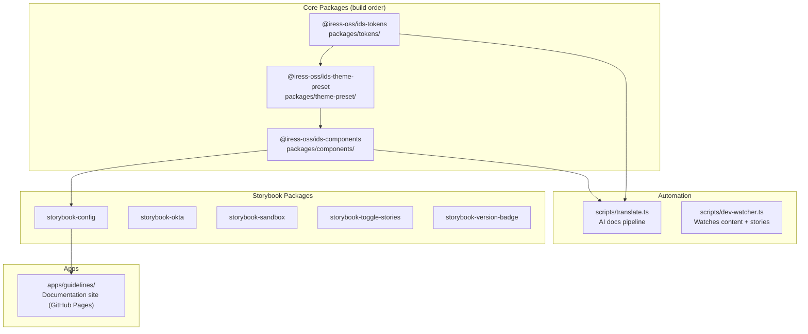
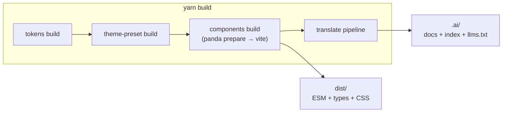
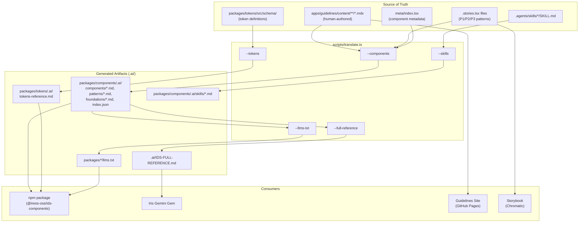
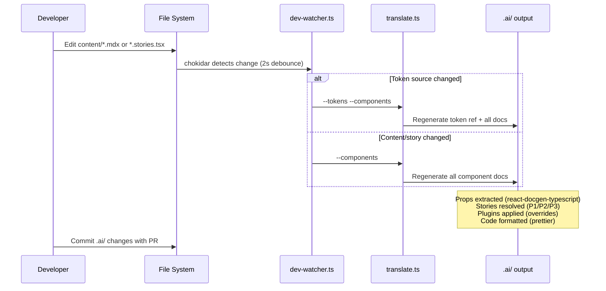
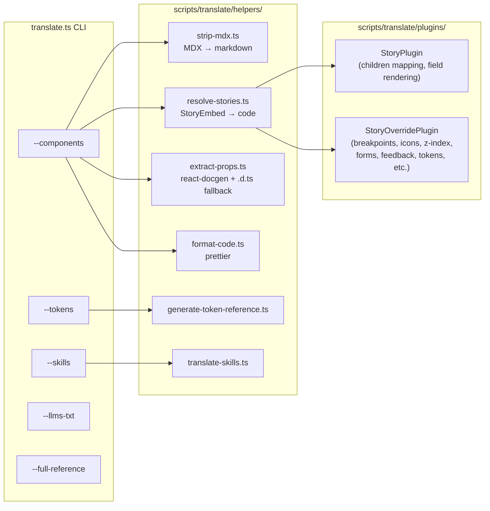
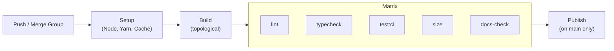

# Architecture

## Monorepo Structure

## Package Dependency Graph

| Package | Depends on | Consumers |
|---------|-----------|-----------|
| `@iress-oss/ids-tokens` | — | theme-preset, components, translate pipeline |
| `@iress-oss/ids-theme-preset` | tokens | components (Panda CSS preset) |
| `@iress-oss/ids-components` | tokens, theme-preset | product applications, guidelines site |
| `@iress-oss/ids-storybook-config` | components | all Storybook addons, component stories |

## Technology Stack

| Layer | Technology | Purpose |
|-------|-----------|---------|
| Components | React 19 + TypeScript | UI library |
| Styling | Panda CSS + design tokens | Zero-runtime CSS-in-JS via theme preset |
| Build | Vite | Library bundling (components, tokens, theme-preset) |
| Testing | Vitest + Testing Library | Unit/integration tests |
| Storybook | Storybook 9 + Chromatic | Component development, visual regression |
| Documentation | MDX + TanStack Router | Guidelines site (SPA on GitHub Pages) |
| Search | Pagefind | Client-side full-text search on guidelines site |
| CI/CD | GitHub Actions | Lint, test, typecheck, size, deploy |
| Package Manager | Yarn 4 (Berry) + Corepack | Monorepo workspace management |
| Linting | ESLint 10 (flat config) + Prettier | Code quality enforcement |

## Build Pipeline

Topological build order is enforced by `yarn monorepo run build`. The translate pipeline runs after all packages are built so it can read the compiled `.d.ts` files for props extraction.

## Documentation Content Flow

Where content lives, what derives from what, and what ships where.

## Dev Workflow

What happens when you edit content or stories during development.

## Translate Pipeline Internals

## CI/CD Pipeline

The `docs-check` job rebuilds the guidelines site and fails if `docs/` is stale vs the committed version.

## Story Patterns (P1/P2/P3)

Stories follow three strict patterns to ensure the translate pipeline can extract clean, standalone code examples for AI documentation. This was a deliberate design decision — stories are both interactive Storybook demos AND the source material for shipped `.ai/` docs.

| Pattern | When to use | How it works |
|---------|-------------|--------------|
| **P1: Args-only** | Simple prop demos | Story has `args: { ... }` with literal values. Pipeline reads args and renders `<IressComponent prop="value" />` |
| **P2: Mock + withSource** | Complex examples, multi-component | A `mocks/` file has the full example. Story imports it with `?raw` and uses `withSource()`. Pipeline reads the raw file directly. |
| **P3: Inline render** | Interactive demos needing state/logic | Story has `render: (args) => <JSX />`. Pipeline extracts the render body and inlines args. |

**Why this matters:** Without these patterns, the pipeline would need to execute Storybook at build time to get rendered output. Instead, stories are statically analysable — the pipeline reads source files, not runtime output. This makes `yarn translate` fast (~5s for 98 docs) and deterministic.

**How it's enforced:**

- ESLint `no-restricted-syntax` bans `...OtherStory.args` spreads in P1 stories (args must be self-contained literals)
- ESLint `no-restricted-syntax` bans `render: () =>` without args (code panel needs args)
- ESLint `ids-local/require-story-meta` warns when primary stories are missing testMeta, description, or stylingProps
- `withCustomSource` and deprecated helpers are banned via `no-restricted-imports`
- Full reference: `.github/instructions/story-patterns.instructions.md`

## Key Design Decisions

| Decision | Rationale |
|----------|-----------|
| Panda CSS (zero-runtime) | No CSS-in-JS overhead at runtime; tokens compile to CSS variables |
| Guidelines MDX is source of truth | Single place to edit documentation; `.ai/` is derived |
| Stories use P1/P2/P3 patterns | Enables automated code extraction without runtime evaluation |
| Props via react-docgen-typescript | Reads TypeScript interfaces directly; `.d.ts` fallback for complex patterns |
| Plugins for story overrides | Generates from source data (constants, configs) — prevents drift |
| `componentStoryMeta()` helper | Standardises testMeta, description, stylingProps without hiding Storybook patterns |
| ESLint enforces quality | Catches missing meta, arg spreads, unprefixed types at authoring time |
| Component prefix (`Iress*`) | Avoids collisions with HTML elements and third-party libraries |
| Committed `.ai/` folder | Ships in npm package; AI tools can read docs without build step |
| `llms.txt` in package root | Standard discovery mechanism for AI agents to find component docs |
